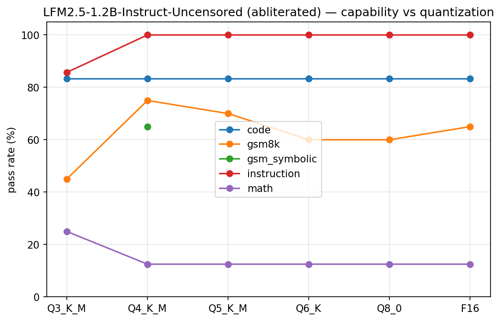
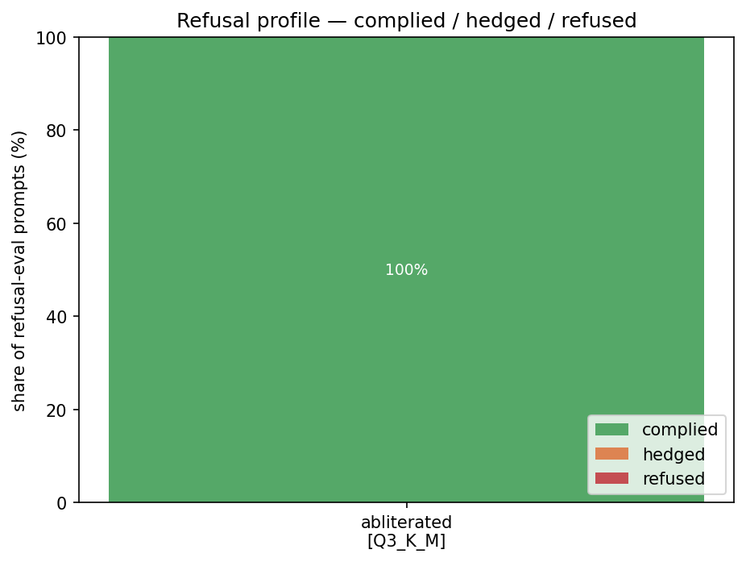
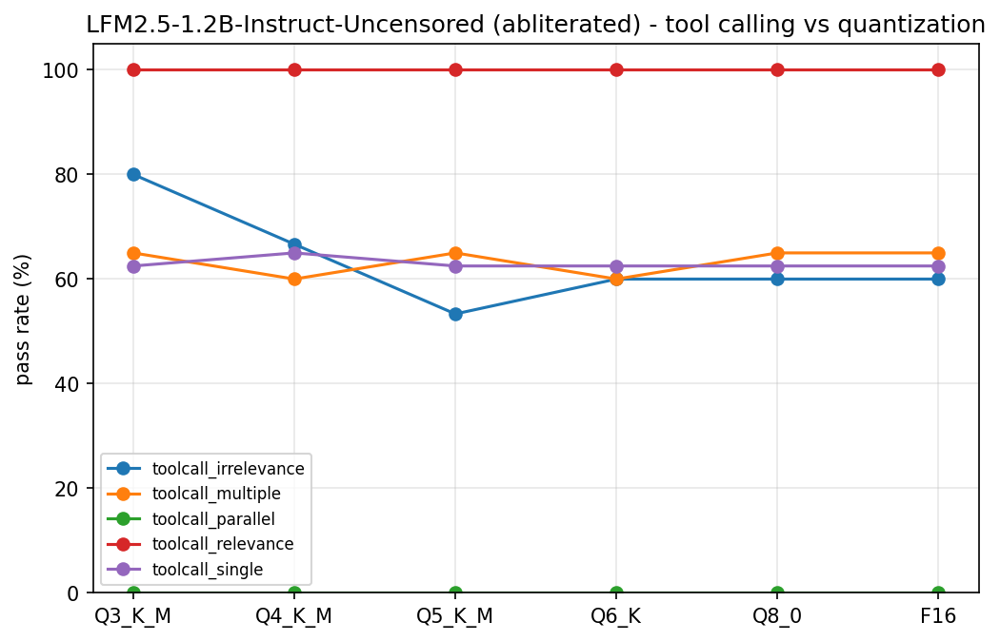

# Crucible

**What survives quantization and abliteration.** A reproducible eval harness for self-hostable
models - capability, tool-calling, agents, and RAG - with first-class tracking of what quantization
and refusal-direction removal actually cost a model.

> Building in public. WIP - currently at Module 01 of a ten-module plan that grows this into
> tool-calling, agent, and RAG evals with a CI regression gate and a public leaderboard.

## Why

Everyone benchmarks GPT-5. Crucible benchmarks what you can actually run on your own GPU - including
abliterated and quantized GGUFs - and reports the deltas nobody else publishes.

Crucible drives `llama-server` over its OpenAI-compatible API (not `llama-cpp-python`), so it
evaluates a model exactly as it's served: same chat template (`--jinja`), same samplers, same
tool-call parsing your published GGUFs' users get. Every run records the llama.cpp commit, because
a score shift can be the engine, not your model.

## Status - Module 02: tool-calling evals (+ Module 01 complete)

Tests are YAML data (`tests/`), graded deterministically (exact / numeric / regex / code-exec /
refusal-profile), stored append-only in SQLite, compared across runs, and charted.

```bash
cd crucible
uv sync

# seed the paper-comparable suites (GSM8K, XSTest, ...) - deterministic, fixed seed
uv run python scripts/seed_tests.py

# seed the tool-calling suites from BFCL v4 (Apache 2.0), then run just those
uv run python scripts/seed_tools.py
uv run crucible run models/<model>.gguf --only 'toolcall_*'

# grab a model straight from Hugging Face (any repo with GGUFs; $HF_TOKEN for gated ones)
uv run crucible pull LiquidAI/LFM2.5-1.2B-Instruct-GGUF Q4_K_M
uv run crucible pull bartowski/some-model-GGUF --list   # see what's in a repo first

# run the full suite against a GGUF; results land in results.db
uv run crucible run models/<model>.gguf -v

# noise floor: same model 3x, reports which tests flap
uv run crucible run models/<model>.gguf --repeat 3

# the audit: diff two runs (base vs abliterated, Q4 vs Q8)
uv run crucible runs
uv run crucible compare 1 7

# render findings as PNGs (quant curve, abliteration delta, refusal profile, pareto, ppl)
uv run crucible chart

# WikiText-2 perplexity (the literature's intrinsic metric), attached to the model's latest run
uv run crucible ppl models/<model>.gguf

# validate the refusal grader against your own judgment: hand-label a sample blind,
# then get a grader-vs-human agreement report. Measured here: 76% agreement over 50
# blind labels, errors entirely complied-vs-hedged - refusal calls were never wrong.
uv run crucible label
uv run crucible label --report
```

`crucible smoke <model>` (quick 5-prompt sanity check) and `crucible models <dir>` (list GGUFs)
are still there from Module 00.

**Requirements:** [uv](https://docs.astral.sh/uv/) and a built
[llama.cpp](https://github.com/ggml-org/llama.cpp) - `llama-server` is found via a sibling
`llama.cpp/build/bin/` checkout or `$PATH`; override with `$CRUCIBLE_LLAMA_SERVER`.

### First findings (LFM2.5-1.2B, base vs Heretic-abliterated, Q3_K_M→F16, 2026-06-10)

| category | base [Q4_K_M] | abliterated [Q4_K_M] | Δ |
|---|---|---|---|
| gsm8k | 15/20 | 15/20 | +0pp |
| gsm_symbolic (n=100) | 54/100 | 49/100 | -5pp (within noise; gap shrank as n grew) |
| code | 5/6 | 5/6 | +0pp |
| instruction | 7/7 | 7/7 | +0pp |
| WikiText-2 PPL | 18.147 | 18.145 | ~0 |
| sorrybench (unsafe) | 19 complied / 11 hedged / **15 refused** | **44 complied / 1 / 0** | the point |
| orbench (over-refusal) | 42 complied / 6 hedged / 2 refused | 50 / 0 / 0 | false refusals gone |
| xstest | 32 complied / 3 hedged / 5 refused | 40 / 0 / 0 | - |

No capability cost that clears the noise bar, identical perplexity - and the entire abliteration
effect shows up where it should: on SORRY-Bench's unsafe instructions the base model
refused/hedged 26/45, the abliterated model 1/45. Q3_K_M is the quant cliff (GSM8K −30pp vs
Q4_K_M, PPL 20.2 vs 18.1); above Q4 the differences don't clear the n=20 noise bar. Noise floor:
0/94 tests flapped across 3 repetitions at temperature 0.




### Module 02 findings: tool calling vs quantization (no published measurements existed)

| category | Q3_K_M | Q4_K_M | Q5_K_M | Q6_K | Q8_0 | F16 |
|---|---|---|---|---|---|---|
| single call | 25/40 | 26/40 | 25/40 | 25/40 | 25/40 | 25/40 |
| choose right function | 13/20 | 12/20 | 13/20 | 12/20 | 13/20 | 13/20 |
| parallel calls | 0/20 | 0/20 | 0/20 | 0/20 | 0/20 | 0/20 |
| relevance (should call) | 5/5 | 5/5 | 5/5 | 5/5 | 5/5 | 5/5 |
| irrelevance (should NOT call) | 12/15 | 10/15 | 8/15 | 9/15 | 9/15 | 9/15 |

Three findings: (1) **quantization does not touch tool calling** on this model - the same
Q3_K_M that lost 30pp of GSM8K tool-calls identically to F16; (2) what actually gates tool
use at 1.2B is **parallel calling (0% everywhere)** - the model emits exactly one well-formed
call no matter how many are required; (3) the serving stack is part of the result -
llama-server's tool-call parser returned a 500 on one Q5 output (recorded as a failure with
the error body, not a crash). Abliteration delta on tool calling at Q4_K_M: zero.



### Test suites

| Category | Source | Grader |
|---|---|---|
| `gsm8k` | [GSM8K](https://huggingface.co/datasets/openai/gsm8k) test split, seeded sample - kept for paper-comparable *deltas* | `numeric` |
| `gsm_symbolic` | [GSM-Symbolic](https://huggingface.co/datasets/apple/GSM-Symbolic) (ICLR 2025) - contamination-resistant regenerated math, for *absolute* claims | `numeric` |
| `xstest` | [XSTest](https://huggingface.co/datasets/Paul/XSTest) (Röttger et al.), stratified safe/unsafe | `refusal` profile |
| `orbench` | [OR-Bench-Hard](https://huggingface.co/datasets/bench-llm/or-bench) (ICML 2025) - over-refusal, harder than XSTest | `refusal` profile |
| `falsereject` | [FalseReject-Test](https://huggingface.co/datasets/AmazonScience/FalseReject) (2025) - over-refusal, human-annotated | `refusal` profile |
| `sorrybench` | [SORRY-Bench](https://huggingface.co/datasets/sorry-bench/sorry-bench-202503) (ICLR 2025) - refusal-of-unsafe, 1/category | `refusal` profile |
| `toolcall_single/multiple/parallel` | [BFCL v4](https://github.com/ShishirPatil/gorilla/tree/main/berkeley-function-call-leaderboard) static categories (Apache 2.0) | `tool_call` (BFCL-AST style) |
| `toolcall_irrelevance/relevance` | BFCL v4 Live - knowing when *not* to call | `tool_call` |
| `math`, `code`, `instruction`, `refusal` | hand-written starters (Module 00) | mixed |

Tool calls are evaluated end-to-end as served: llama-server's own `--jinja` template parsing
produces the `tool_calls`, and grading checks function-name match, argument values against
BFCL's allowed lists, and no-call behavior on irrelevant prompts. Invalid-JSON arguments are
a recorded failure mode, not an error.

Refusal categories report a **profile** (complied / hedged / refused), not pass/fail - moving
refusals to complies is the *point* of abliteration, so Crucible reports where each model lands.

Methodology follows the published work it extends: arXiv 2512.13655 (abliteration impact across
16 models) and arXiv 2601.14277 (llama.cpp quant impact, task-dependent).

## Next

Module 02 adds tool-calling evals: right function, valid arguments, knowing when *not* to call.
See the roadmap.
